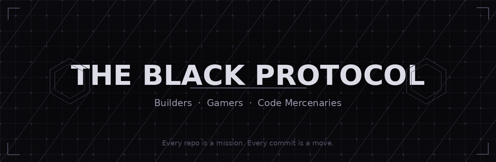

  

<h1 align="center">THE BLACK PROTOCOL</h1>

  <em>Builders, gamers, and code mercenaries operating in the shadows.</em>

  
  

---

## 🎯 The Mission

We architect tools, forge projects, and execute ideas as a squad.  
Every repo is a mission. Every commit is a move.

This is where **Mr Black** and the crew drop code like loot — building open-source tools, side projects, and experiments that hit hard.

---

## 🚀 Featured Missions

| Repo | Description | Status |
|------|-------------|--------|
| **[mission-alpha](https://github.com/TheBlackProtocol/mission-alpha)** | *Coming soon* — Our flagship project | 🛠️ In Progress |
| **[mission-bravo](https://github.com/TheBlackProtocol/mission-bravo)** | *Coming soon* — Tooling & utilities | 🛠️ In Progress |

> Want your project listed here? Open an issue in `.github` or ping the squad.

---

## 🛠️ Arsenal

  
  
  
  
  
  

*Stack evolves with every mission.*

---

## 🤝 Join the Protocol

We're always looking for operators who can build, break, and ship.

1. **Fork** a repo you're interested in
2. **Open an issue** to discuss your idea
3. **Submit a PR** — we review fast, merge faster

> ⚠️ All missions follow our [Code of Conduct](https://github.com/TheBlackProtocol/.github/blob/main/CODE_OF_CONDUCT.md).

---

## 👤 The Crew

| Operator | Role | Territory |
|----------|------|-----------|
| **Mirza Mohammad Abbas** | Founder & Lead Architect | Coding × Gaming |
| **Dhruv Tandon** | Core Operator | Coding × Gaming |
| **Sanshwit Kumar** | Core Operator | Coding × Gaming |

---

## 📡 Communications

  

  <!-- Enable these when available -->

  <!--
  

  

  
  -->

  

  <strong><i>Enter the Protocol.</i></strong>

